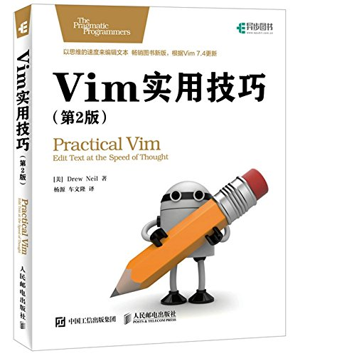
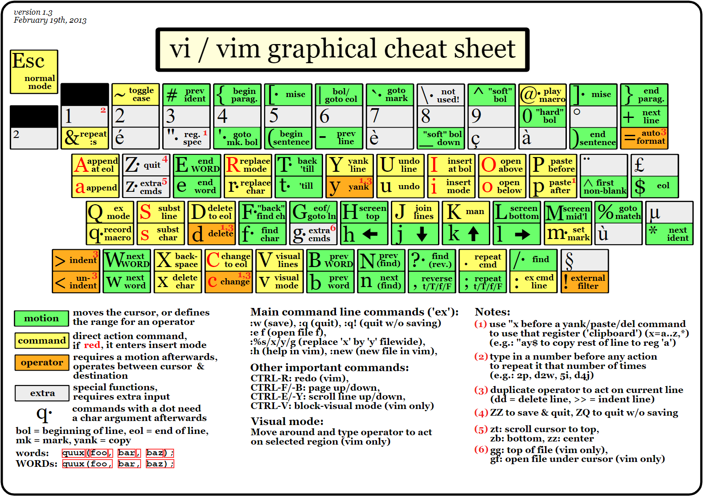
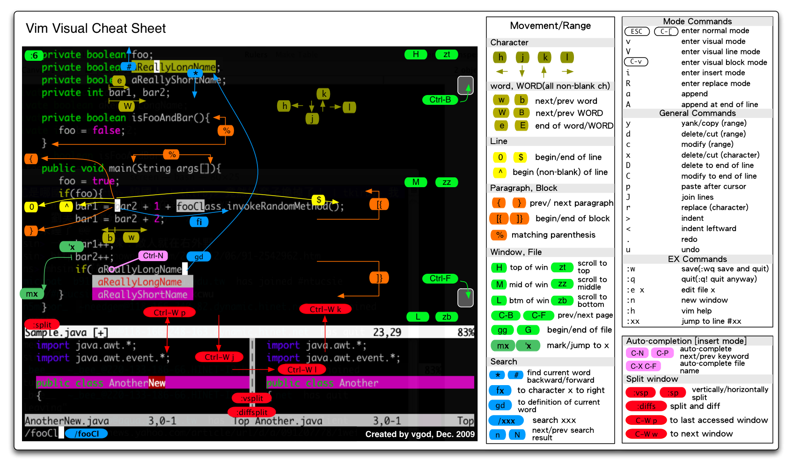
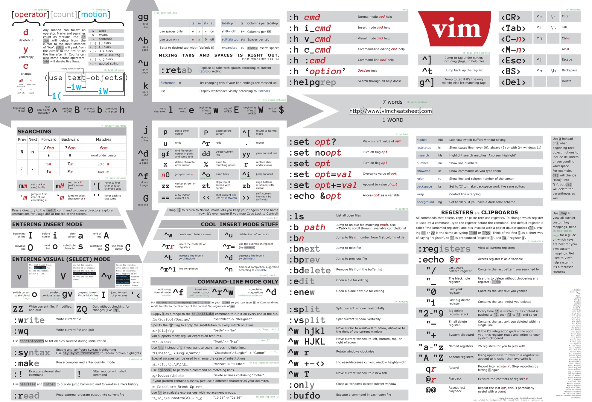
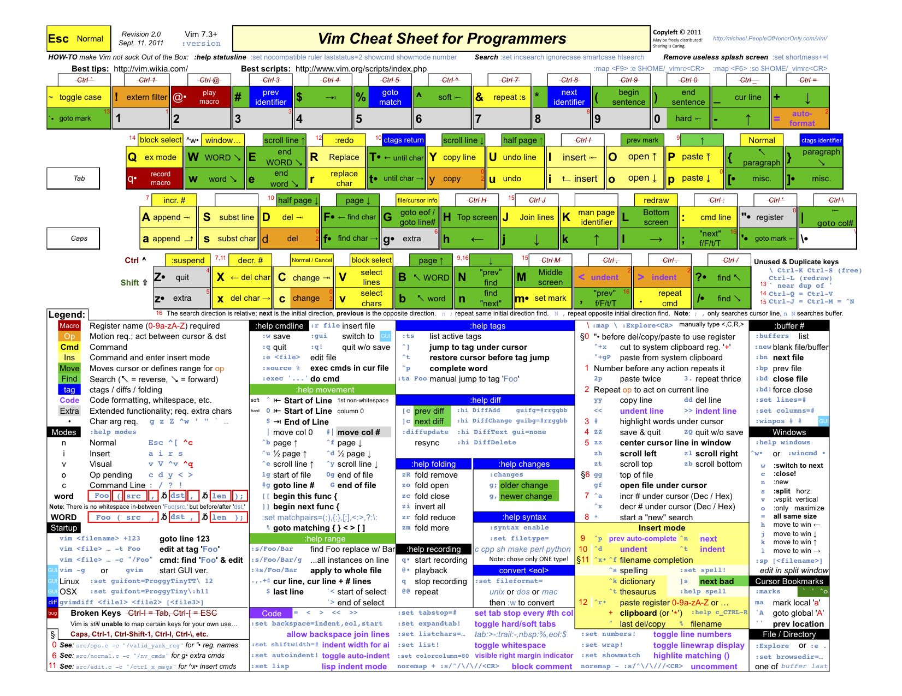

# Vim 基本功（Learn Vim）



## 本仓库内容

1. Vim基本功学习笔记

* GitBook:<https://yifengyou.gitbooks.io/learn-vim/content/>
* GitHub:<https://github.com/yifengyou/learn-vim/>
* GitPage:<https://yifengyou.github.io/learn-vim/>

```
Something I hope you know before go into the coding~
First, please watch or star this repo, I'll be more happy if you follow me.
Bug report, questions and discussion are welcome, you can post an issue or pull a request.
```
---

## 目录

* [读我](README.md)
* [基本模式](docs/基本模式.md)
* [打开文件](docs/打开文件.md)
* [保存退出](docs/保存退出.md)
* [命令模式](docs/命令模式.md)
    * [移动光标](docs/命令模式/移动光标.md)
    * [插入](docs/命令模式/插入.md)
    * [替换](docs/命令模式/替换.md)
    * [改写](docs/命令模式/改写.md)
    * [复制粘贴](docs/命令模式/复粘贴制.md)
    * [删除](docs/命令模式/删除.md)
    * [合并](docs/命令模式/合并.md)
    * [查找](docs/命令模式/查找.md)
    * [块操作](docs/命令模式/块操作.md)
    * [缩进](docs/命令模式/缩进.md)
    * [格式化](docs/命令模式/格式化.md)
    * [窗口分屏](docs/命令模式/窗口分屏.md)
    * [标签页](docs/命令模式/标签页.md)
    * [书签](docs/命令模式/书签.md)
    * [Vim宏录制](docs/命令模式/Vim宏录制.md)
    * [Vim重复操作命令](docs/命令模式/Vim重复操作命令.md)
    * [撤销重做](docs/命令模式/撤销重做.md)
    * [位置跳转](docs/命令模式/位置跳转.md)
    * [代码折叠](docs/命令模式/代码折叠.md)
    * [Vim可视化模式](docs/命令模式/Vim可视化模式.md)
* [编辑模式](docs/编辑模式.md)
    * [删除操作](docs/编辑模式/删除操作.md)
    * [移动光标](docs/编辑模式/移动光标.md)
    * [调整缩进](docs/编辑模式/调整缩进.md)
    * [复制](docs/编辑模式/复制.md)
    * [寄存器](docs/编辑模式/寄存器.md)
    * [自动补全](docs/编辑模式/自动补全.md)
    * [输入非常用字符](docs/编辑模式/输入非常用字符.md)
* [末行模式](docs/末行模式.md)
    * [normal 命令](docs/末行模式/normal 命令.md)
    * [替换](docs/末行模式/替换.md)
    * [Vim寄存器](docs/末行模式/Vim寄存器.md)
    * [Vim内部执行shell命令](docs/末行模式/Vim内部执行shell命令.md)
    * [Vim启动可交互shell](docs/末行模式/Vim启动可交互shell.md)
    * [标准输入输出重定向](docs/末行模式/标准输入输出重定向.md)
    * [Quickfix 窗口](docs/末行模式/Quickfix窗口.md)
    * [帮助信息](docs/末行模式/帮助信息.md)
* [Vim插件](docs/Vim插件.md)
    * [vundle插件管理工具](docs/Vim插件/vundle插件管理工具.md)
    * [NERDTree目录树](docs/Vim插件/NERDTree目录树.md)
    * [YouCompleteMe自动补齐](docs/Vim插件/YouCompleteMe自动补齐.md)
* [.vimrc配置](docs/vimrc配置.md)

---

## 推荐 vim 配置方案

  - [dofy / **7th-vim**](https://github.com/dofy/7th-vim)
  - [kepbod / **ivim**](https://github.com/kepbod/ivim)
  - [chxuan / **vimplus**](https://github.com/chxuan/vimplus)
  - [SpaceVim / **SpaceVim**](https://github.com/SpaceVim/SpaceVim)


## 参考教程

- 控制台运行 `vimtutor` 这是 vim 官方实操教程
- [简明 Vim 练级攻略] : <http://coolshell.cn/articles/5426.html>
- [vim galore] : <https://github.com/mhinz/vim-galore>
- [每日一Vim] : <http://liuzhijun.iteye.com/category/270228>
- [vim 编辑操作] : <https://blog.csdn.net/weixin_43378248/article/details/85554935>
- [vim操作全面讲解] : <https://www.cnblogs.com/hustskyking/archive/2013/06/11/linux-learning-details.html>
- [awesome-cheatsheets] : <https://github.com/skywind3000/awesome-cheatsheets/blob/master/editors/vim.txt>
- [最新版本] : <https://github.com/vim/vim>   
- [Windows 最新版] : <https://github.com/vim/vim-win32-installer/releases>
- [插件浏览] : <http://vimawesome.com>
- [reddit] : <https://www.reddit.com/r/vim/>
- [正确设置 ALT/BS 键] : <http://www.skywind.me/blog/archives/2021>
- [视频教程] : <http://vimcasts.org/>
- [中文帮助] : <http://vimcdoc.sourceforge.net/doc/help.html>
- [中文版入门到精通] : <https://github.com/wsdjeg/vim-galore-zh_cn>
- [五分钟脚本入门] : <http://www.skywind.me/blog/archives/2193>
- [脚本精通] : <http://learnvimscriptthehardway.stevelosh.com/>
- [中文脚本帮助] : <http://vimcdoc.sourceforge.net/doc/eval.html>
- [十六年使用经验] : <http://zzapper.co.uk/vimtips.html>
- [配色方案] : <http://vimcolors.com/>

## 图解Vim


* <http://www.nathael.org/Data/vi-vim-cheat-sheet.svg>


* <http://people.csail.mit.edu/vgod/vim/vim-cheat-sheet-en.png>


* <https://cdn.shopify.com/s/files/1/0165/4168/files/preview.png>


* <http://michael.peopleofhonoronly.com/vim/vim_cheat_sheet_for_programmers_screen.png>

## 小结

- 永远不要用 CTRL-C 代替 <ESC> 完全不同的含义，容易错误中断运行的后台脚本
- 很多人使用 CTRL-[ 代替 <ESC>，左手小指 CTRL，右手小指 [ 熟练后很方便
- 某些终端中使用 Vim 8 内嵌终端如看到奇怪字符，使用 :set t_RS= t_SH= 解决
- 某些终端中使用 NeoVim 如看到奇怪字符，使用 :set guicursor= 解决
- 多使用 ciw, ci[, ci", ci( 以及 diw, di[, di", di( 命令来快速改写/删除文本
- 在行内左右移动光标时，多使用w b e或W B E，而不是h l或方向键，这样会快很多
- SHIFT 相当于移动加速键， w b e 移动光标很慢，但是 W B E 走的很快
- 自己要善于总结新技巧，比如移动到行首非空字符时用 0w 命令比 ^ 命令更容易输入
- 在空白行使用 dip 命令可以删除所有临近的空白行，viw 可以选择连续空白
- 缩进时使用 >8j  >}  <ap  >ap  =i}  == 会方便很多
- 插入模式下，当你发现一个单词写错了，应该多用 CTRL-W 这比 <BackSpace> 快
- y d c 命令可以很好结合 f t 和 /X 比如 dt) 和 y/end<cr>
- c d x 命令会自动填充寄存器 "1 到 "9 , y 命令会自动填充 "0 寄存器
- 用 v 命令选择文本时，可以用 o 掉头选择，有时很有用
- 写文章时，可以写一段代码块，然后选中后执行 :!python 代码块就会被替换成结果
- 搜索后经常使用 :nohl 来消除高亮，使用很频繁，可以 map 到 <BackSpace> 上
- 搜索时可以用 CTRL-R CTRL-W 插入光标下的单词，命令模式也能这么用
- 映射按键时，应该默认使用 noremap ，只有特别需要的时候使用 map
- 当你觉得做某事很低效时，你应该停下来，u u u u 然后思考正确的高效方式来完成
- 用 y复制文本后，命令模式中 CTRL-R 然后按双引号 0 可以插入之前复制内容
- Windows 下的 GVim 可以设置 set rop=type:directx,renmode:5 增强显示
