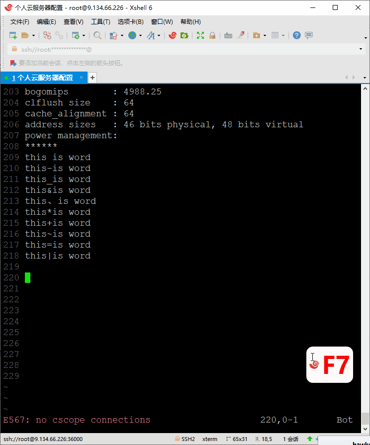

# Vim重复操作命令

## 重复上一次命令

vim 有一个特殊的命令 `.`，你可以用它重复执行上一个命令。

> 按下面的说明进行操作

```
按 dd 删除本行
按 . 重复删除操作
2. 再删除两行
这行也没了
p 把刚才删掉的粘回来
3. 又多出 6 行
```

## 重复次数

在命令模式下，输入一个数字，再跟上一个命令，就可以让该命令 重复执行指定次数

示例步骤：
```
输入 n ，次数
按下 i ，进入编辑模式
输入 * ，字符
按下 Esc，返回命令模式
输出 n 次个 * 字符
```

**进入编辑模式之前，请勿按数字**


