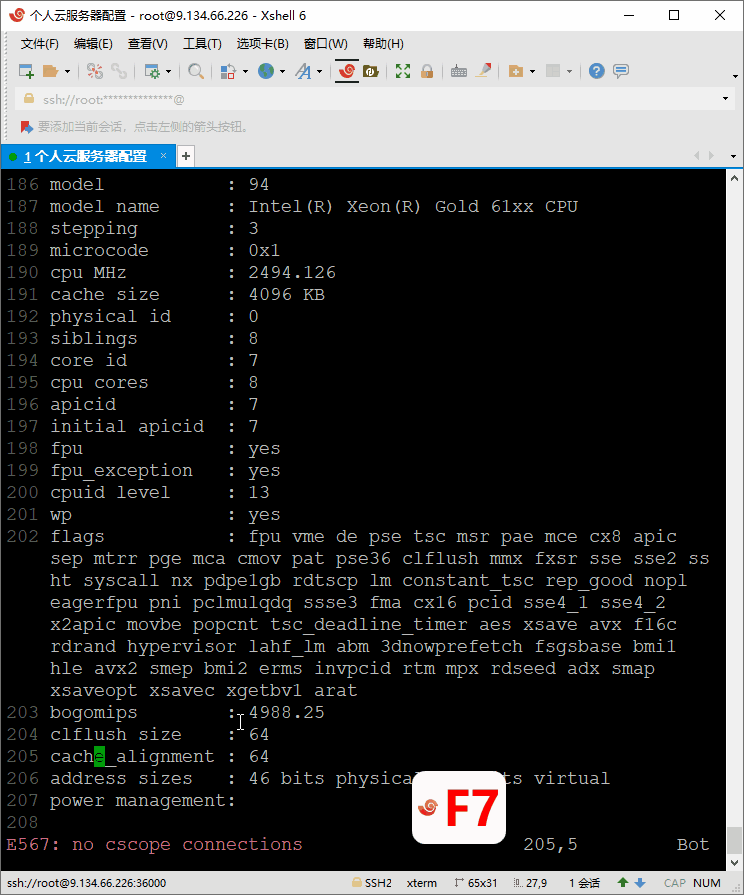
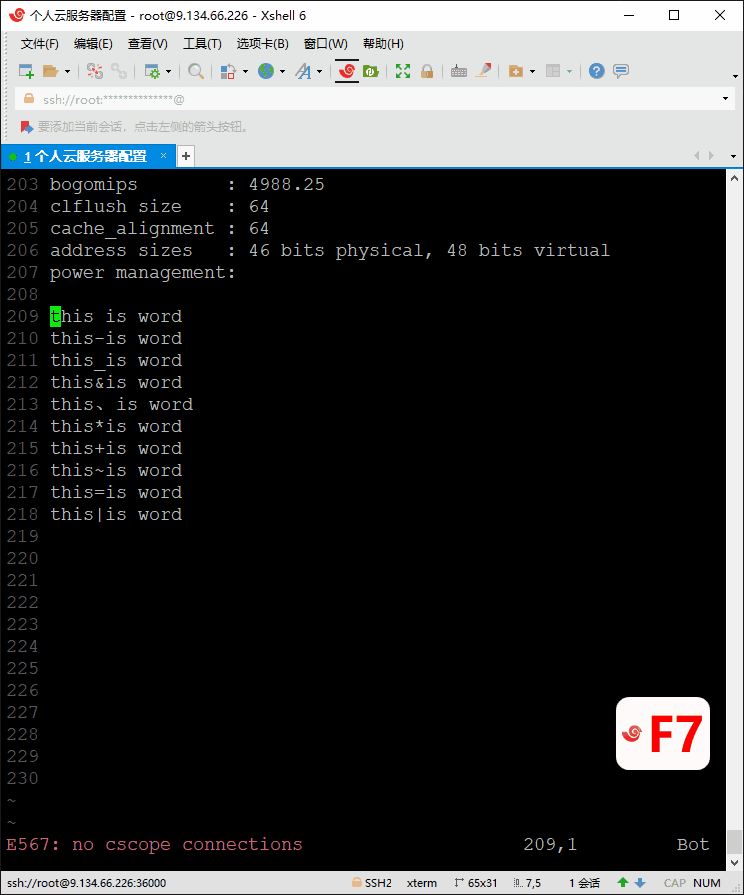

<!-- MDTOC maxdepth:6 firsth1:1 numbering:0 flatten:0 bullets:1 updateOnSave:1 -->

- [光标的移动](#光标的移动)   
   - [字符/行单位级别移动](#字符行单位级别移动)   
   - [单词级别移动](#单词级别移动)   
   - [块级移动](#块级移动)   
   - [屏幕移动](#屏幕移动)   
   - [段落移动](#段落移动)   

<!-- /MDTOC -->
# 移动光标

```
h                   光标左移，同 <Left> 键
j                   光标下移，同 <Down> 键
k                   光标上移，同 <Up> 键
l                   光标右移，同 <Right> 键
CTRL-F              下一页
CTRL-B              上一页
CTRL-U              上移半屏
CTRL-D              下移半屏
0                   跳到行首（是数字零，不是字母O），效用等同于 <Home> 键
^                   跳到从行首开始第一个非空白字符
$                   跳到行尾，效用等同于 <End> 键
gg                  跳到第一行，效用等同于 CTRL+<Home>
G                   跳到最后一行，效用等同于 CTRL+<End>
nG                  跳到第n行，比如 10G 是移动到第十行
:n                  跳到第n行，比如 :10<回车> 是移动到第十行
10%                 移动到文件 10% 处
15|                 移动到当前行的 15列
w                   跳到下一个单词开头 (word: 标点或空格分隔的单词)
W                   跳到下一个单词开头 (WORD: 空格分隔的单词)
e                   跳到下一个单词尾部 (word: 标点或空格分隔的单词)
E                   跳到下一个单词尾部 (WORD: 空格分隔的单词)
b                   上一个单词头 (word: 标点或空格分隔的单词)
B                   上一个单词头 (WORD: 空格分隔的单词)
ge                  上一个单词尾
)                   向前移动一个句子（句号分隔）
(                   向后移动一个句子（句号分隔）
}                   向前移动一个段落（空行分隔）
{                   向后移动一个段落（空行分隔）
<enter>             移动到下一行首个非空字符
+                   移动到下一行首个非空字符（同回车键）
-                   移动到上一行首个非空字符
H                   移动到屏幕上部
M                   移动到屏幕中部
L                   移动到屏幕下部
fx                  跳转到下一个为 x 的字符，2f/ 可以找到第二个斜杆
Fx                  跳转到上一个为 x 的字符
tx                  跳转到下一个为 x 的字符前
Tx                  跳转到上一个为 x 的字符前
;                   跳到下一个 f/t 搜索的结果
,                   跳到上一个 f/t 搜索的结果
<S-Left>            按住 SHIFT 按左键，向左移动一个单词
<S-Right>           按住 SHIFT 按右键，向右移动一个单词
<S-Up>              按住 SHIFT 按上键，向上翻页
<S-Down>            按住 SHIFT 按下键，向下翻页
gm                  移动到行中
gj                  光标下移一行（忽略自动换行）
gk                  光标上移一行（忽略自动换行）
```

## 字符/行单位级别移动

- `h` 向左一字符
- `j` 下一行
- `k` 上一行
- `l` 向右一字符





## 单词级别移动

- `w` or `W`
  * 大小写一样效果
  * 向**右**移动到下一单词开头。
  * 如果是单词中间任意位置，移到下一个单词开头
  * 如果是空字符，**右**移到下一个非空字符/单词**开头**
- `e` or `E`
  * 大小写一样效果
  * 向**右**移动到单词结尾。
  * 如果是当前单词中间，移到尾部
  * 如果是空字符，**右**移到下一个非空字符/单词**结尾**
- `b` or `B`
  * 大小写一样效果
  * 向**左**移动到单词**开头**
  * 单词中间则移到开头
  * 如果是空字符，**左**移到前一个非空字符/单词**开头**

**注意：所有小写单词都是以分词符作为单词界限，大写字母以空格作为界限**

* 分词符，比如 ```- _```，我反正测试到的就这两个字符事儿多，默认会把它跟字母看做一样，因为英语单词是允许酱紫的
* 如果要强制跳过分词符，就用**大写**的，也就是说```<Shift+w/e/b>```




> 在下面字符块中感受一下各种移动吧！

```
This project's GitHub url is https://github.com/dofy/learn-vim
Please clone it to your local folder and open the first file which is
named file-one.md via following command "vim file-one.md"
and welcome to http://geekpark.net :)
```

## 块级移动

- `gg` 到文档第一行
- `G` 到文档最后一行
- `0` 到行首（第 1 列）
- `^` 到第一个非空白字符
- `$` 到行尾
- `Ctrl-d` 向下移动半页
- `Ctrl-u` 向上移动半页
- `Ctrl-f` 向下移动一页
- `Ctrl-b` 向上移动一页
- `:<N>` or `<N>gg` 跳转到第 N 行
- `:+<N>` or `<N>j` 向下跳 N 行
- `:-<N>` or `<N>k` 向上跳 N 行

_注意：所有命令前都可以加一个数字 N，表示对后面的命令执行 N 次，例如你想向下移动 3 行，除了
可以用 `:+3` 之外，还可以用 `3j` 来实现同样的效果。另外，上面实际上有两种命令：一种是键入后
立即执行的，比如 `gg`；还有一种是先输入 `:` 的（后面还会出现先按 `/` 的），这类命令需要在
输入完成后按回车执行，后面的教程中也是一样。_

> 现在你可以在当前文件中畅游了，当你熟悉了各种移动操作后就可以通过 `G` 定位到当前文档到最后
> 一行，按照提示进入下一章了。
>


## 屏幕移动


Ctrl + b	back	向上翻页
Ctrl + f	forward	向下翻页
H	Head	快速移动到 屏幕顶部非空行首
M	Middle	快速移动到 屏幕中间非空行首
L	Low	快速移动到 屏幕底部非空行首


## 段落移动
序号	命令	英文	作用
01	{		上一空行段
02	}		下一空行段
03	%		括号匹配及切换
04	mX	mark	添加标记 A - Z 任意大小写字母
05	`X		直接定位到标记 X 所在位置
Explain：

标记行若被删除，标记同时被删除
添加相同标记行，标记同时被替换
