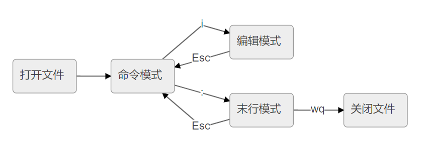

<!-- MDTOC maxdepth:6 firsth1:1 numbering:0 flatten:0 bullets:1 updateOnSave:1 -->

- [基本模式](#基本模式)   
   - [插入模式 - 命令模式](#插入模式-命令模式)   
   - [末行模式 - 命令模式](#末行模式-命令模式)   
   - [命令模式 - 末行模式](#命令模式-末行模式)   

<!-- /MDTOC -->
# 基本模式

## 插入模式 - 命令模式

| 按键操作 | 用途                  |
| -------- | -------------------- |
| Esc      | 返回普通模式          |
| Ctrl + [ | 返回普通模式          |
| Ctrl + o | 切换到“插入-普通模式”  |

## 末行模式 - 命令模式

| 按键操作 | 用途                  |
| -------- | --------------------- |
| Esc      | 返回普通模式          |
| Ctrl + [ | 返回普通模式          |
| Ctrl + o | 切换到“插入-普通模式” |

## 命令模式 - 末行模式

| 按键操作 | 用途                  |
| -------- | --------------------- |
| Esc      | 返回普通模式          |
| Ctrl + [ | 返回普通模式          |
| Ctrl + o | 切换到“插入-普通模式” |

---
